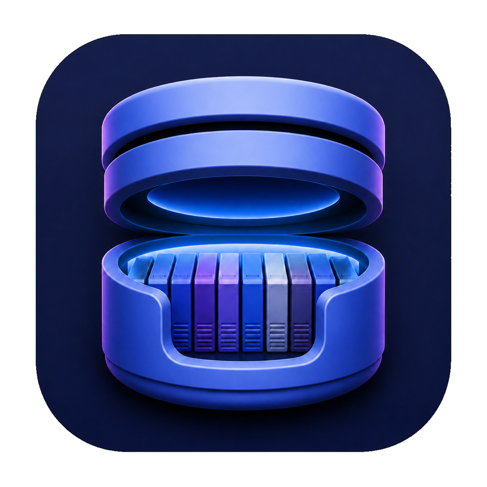
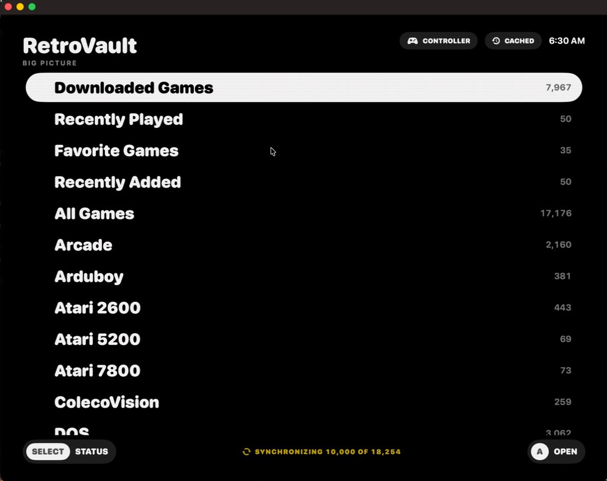

<p align="center">
  
</p>

<h1 align="center">RetroVault</h1>

<p align="center">
  <strong>A native macOS library and player for RomM.</strong>
</p>

<p align="center">
  <a href="MILESTONES/README.md"></a>
  
  
  
  <a href="LICENSE"></a>
</p>

RetroVault connects a Mac to a single [RomM](https://romm.app) server and turns
its catalog into a fast, controller-first game library. It synchronizes
metadata for offline browsing, manages local downloads for offline play, and
launches supported titles without reorganizing or duplicating the server's
library. RomM is developed by the
[RomM Project](https://github.com/rommapp/romm).

RomM remains the source of truth. RetroVault adds native macOS presentation,
Metal video, controller navigation, managed firmware, save synchronization,
and emulation through bundled Libretro cores plus hosted Cemu and Vita3K
engines.



> [!IMPORTANT]
> RetroVault is under active development. It currently requires macOS 26 on
> Apple silicon and targets the RomM 5.x API. Compatibility and save handling
> still vary by system and title.

## Highlights

- Controller-first browsing for downloaded games, recent games, favorites,
  the complete catalog, and individual systems.
- Offline metadata and artwork cache with managed game downloads.
- Download, export, firmware, save, and save-state workflows that keep RomM as
  the authoritative library.
- Metal rendering with native, LCD, and CRT presentation modes.
- Windowed and fullscreen play, Game Mode, rewind, fast-forward, quick resume,
  and multi-controller support where the engine allows them.
- Native macOS controllers and DSU/Cemuhook input, including the Switch 2 Pro
  Controller through
  [switch2bridge-macos](https://github.com/kennethreitz/switch2bridge-macos).
- A controller-friendly Save Center for local, remote, pending, and failed
  save synchronization.

## Emulation

RetroVault bundles Apple-silicon Libretro cores and manages their video, audio,
input, firmware, and save paths. Cemu and Vita3K are hosted standalone engines:
RetroVault prepares their private installations and integrates them with the
same library, controller, and save workflows.

| Systems | Engine | Integration |
| --- | --- | --- |
| Game Boy, Game Boy Color | Gambatte | Libretro |
| Game Boy Advance | mGBA | Libretro |
| NES | Nestopia UE | Libretro |
| SNES | bsnes-mercury Balanced | Libretro |
| Nintendo 64 | ParaLLEl-N64 | Libretro |
| Nintendo DS | melonDS | Libretro |
| GameCube, Wii | Dolphin | Libretro |
| Wii U | Cemu | Hosted, experimental; Metal or Vulkan |
| Master System, Game Gear, SG-1000 | Gearsystem | Libretro |
| Genesis / Mega Drive, Sega CD / Mega CD | Genesis Plus GX | Libretro |
| Sega 32X | PicoDrive | Libretro |
| Dreamcast | Flycast | Libretro, experimental |
| PlayStation | PCSX-ReARMed | Libretro |
| PlayStation Portable | PPSSPP | Libretro |
| PlayStation Vita | Vita3K | Hosted, experimental |
| PC Engine / TurboGrafx-16, SuperGrafx, PC Engine CD | Beetle PCE | Libretro |
| Atari 2600, 5200, 7800 | Stella 2014, A5200, ProSystem | Libretro |
| ColecoVision | Gearcoleco | Libretro |
| Neo Geo Pocket / Color | Beetle NeoPop | Libretro |
| WonderSwan / Color | Beetle Cygne | Libretro |
| Arcade | FinalBurn Neo | Libretro |
| DOS | DOSBox Pure | Libretro |
| Virtual Boy | Beetle VB | Libretro |
| Pokemon Mini | PokeMini | Libretro |
| Arduboy | Arduous | Libretro |
| Pico-8 | FAKE-08 | Libretro, experimental |

Exact core revisions, licenses, hashes, and build requirements are recorded in
[`Libretro/CoreManifest.json`](Libretro/CoreManifest.json). RetroVault does not
bundle games, firmware, BIOS files, or cryptographic keys.

## Preservation

RetroVault is built for personal game archives whose historical value extends
beyond the game files themselves. Metadata, regional releases, artwork,
firmware relationships, and player saves all help preserve software whose
original media, hardware, storefronts, and online services will not remain
available forever.

Support therefore focuses on systems with maintainable Apple-silicon emulation
and dependable save handling. RomM can still catalog unsupported platforms;
RetroVault preserves and presents that catalog without claiming every title is
playable.

## Build

Requirements: an Apple-silicon Mac, macOS 26 or later, and Xcode 26 or later.

```shell
open RetroVault.xcodeproj
```

Command-line builds and tests:

```shell
swift build
swift test
Scripts/build-app.sh
```

Project history is recorded in [`CHANGELOG.md`](CHANGELOG.md), and core build
details live in [`Libretro/README.md`](Libretro/README.md).

## License

RetroVault original code is licensed under the GNU General Public License,
version 2 or later, with the narrowly scoped RetroVault Core Linking
Exception. Bundled cores and hosted emulators retain their own licenses; some
components prohibit commercial use. See [LICENSE](LICENSE) and
[THIRD_PARTY_NOTICES.md](THIRD_PARTY_NOTICES.md).
