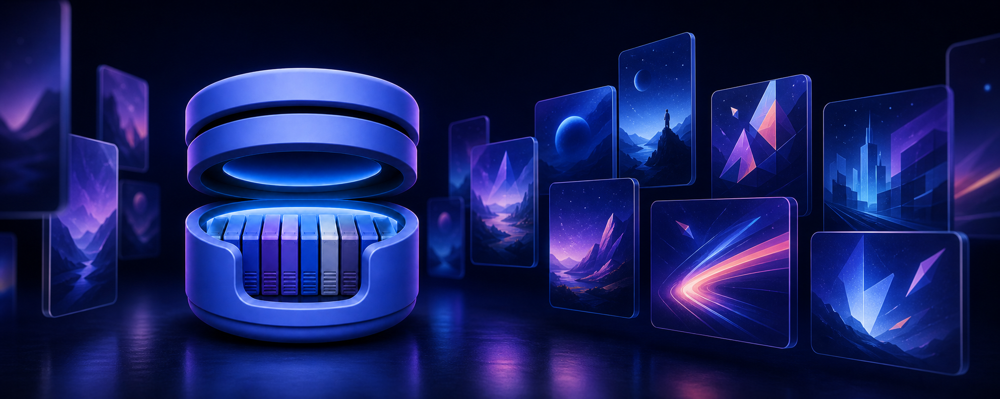

<p align="center">
  
</p>

<p align="center">
  
</p>

<h1 align="center">OpenVault</h1>

<p align="center">
  <strong>A native home for preserved game libraries.</strong>
</p>

<p align="center">
  <a href="MILESTONES/README.md"></a>
  
  
  
  <a href="LICENSE"></a>
</p>

OpenVault is a native macOS client for [RomM](https://romm.app), the
self-hosted, open-source game-library manager developed by
[the RomM Project](https://github.com/rommapp/romm). It turns the library you
already preserve into a fast, artwork-rich Mac experience inspired by Music
and Photos—without importing, reorganizing, or creating a competing catalog.

Connect one server. Browse everything. Keep the metadata and games you choose
available offline. Press Play.

> [!IMPORTANT]
> OpenVault is under active development and is not ready for a general release.
> It currently targets macOS 26 on Apple silicon and the RomM 5.x API. Expect
> rough edges, especially in emulator compatibility and save synchronization.

## Preservation, not platform chasing

Video-game libraries are historical collections. The game files matter, but
so do their names, releases, regions, revisions, artwork, manuals, hashes,
firmware relationships, and the saves created while playing them. Together,
those records document a medium whose original cartridges, discs, hardware,
storefronts, and online services will not remain available forever.

[RomM](https://github.com/rommapp/romm) is the source of truth for that
collection. OpenVault's role is to make the archive pleasant to explore and
practical to use on a modern Mac. Offline metadata, managed local copies,
export, firmware handling, and save synchronization are preservation features:
an archive is more resilient when it remains understandable, inspectable, and
usable rather than becoming a directory of anonymous files.

OpenVault deliberately focuses on older systems. It is not trying to put the
largest possible platform count on a feature list, and it will not label a
system “supported” merely because one title reaches a boot screen. A platform
belongs in the reviewed list only when its Apple-silicon emulation path is
mature enough for dependable video, audio, input, content loading, firmware,
offline play, and save handling.

Newer systems often depend on rapidly changing emulators, JIT compilation,
specialized graphics behavior, protected system software, complex multi-file
formats, or per-title workarounds. Pretending those systems have durable,
native support would work against the preservation goal. RomM may catalog
them, and OpenVault will preserve and display their library metadata, but
playback remains intentionally unavailable until the complete experience can
meet the same standard as the reviewed historical systems.

The boundary can move as open-source emulation matures. Accuracy, reliability,
and long-term maintainability—not novelty—decide when it does.

## Development status

OpenVault is already being exercised against a real 18,000+ game RomM library.
The native library and offline foundation are working; playback and
living-room features are in active compatibility testing.

| Area | Status | What that means today |
| --- | --- | --- |
| Remote RomM library | **Working** | Pair with one RomM server, synchronize its complete library, and browse systems and collections. |
| Native library UI | **Working** | Artwork and List views, an iTunes-style column browser, search, sorting, multiple selection, and contextual actions. |
| Offline experience | **Working** | Cached metadata, details, artwork, search, collections, downloaded games, firmware, and saves remain useful without RomM. |
| Downloads and export | **Working** | Download keeps a managed local copy; Export writes a shareable copy to Downloads. Bulk operations report live byte progress. |
| Game details | **Working** | Rich metadata, files, media, save data, editable personal status, and confirmed deletion from RomM. |
| Bundled Libretro | **In testing** | 25 reviewed ARM64 cores, native Metal presentation, audio, controllers, fullscreen, rewind, and quick states. |
| Save synchronization | **In testing** | Cartridge save RAM is refreshed before play and uploaded as a new RomM revision after it changes. Quick states stay local. |
| Big Picture | **In testing** | A controller-first, fullscreen interface with the same cached library and playback pipeline. |
| Managed local RomM | **Planned** | A future milestone will provision RomM through Apple's container technologies without Docker. |
| Signed public release | **Not yet** | Keychain migration, compatibility hardening, signing, notarization, and release packaging remain blockers. |

The detailed scope and acceptance criteria live in
[`MILESTONES/`](MILESTONES/README.md).

## What works

### A library that feels native

- Artwork-first system and collection views
- A fast native List for All Games
- Reorderable, persistent column-browser filters
- User-created, smart, and automatic virtual RomM collections
- Favorites, Downloaded, and recently added views
- Toolbar search across the active destination or every system
- Persisted filters for BIOS entries and missing artwork
- Background artwork pre-caching with visible progress
- Full keyboard navigation and native multiple selection
- A built-in unified-log viewer

### RomM, online or off

- Pairing-code exchange and direct client-token entry
- One configured local or remote server
- HTTPS plus explicitly configured local-network HTTP
- Transactional full-library synchronization
- Cache-first launch and offline library browsing
- Managed local ROM downloads and explicit exports
- System firmware fetched from RomM, verified, and cached
- Editable completion, rating, difficulty, play status, backlog, and visibility
- Read-only browsing of RomM saves and save states

### Native playback

- A Swift-owned Libretro frontend with reviewed, bundled ARM64 cores
- Software and OpenGL video presented through a nearest-neighbor Metal pipeline
- Core Audio output and native GameController support
- Windowed and immersive fullscreen play
- Automatic local quick-state resume with a **Start Fresh** option
- Bounded in-memory rewind
- Automatic quick state on clean or implicit exit
- Cartridge-save refresh before launch and revisioned upload after play
- Play-on-demand caching, so a game can launch again while RomM is offline

### Big Picture

- Dedicated fullscreen presentation inspired by MinUI
- Controller, keyboard, and mouse navigation
- Recently Added, Downloaded, systems, and RomM collections
- In-place game launch and a clean return to the library
- Live progress for large downloads

## Reviewed systems

The application currently bundles the following reviewed core paths. This is a
curated preservation target, not a list of every platform RomM can catalog or
every emulator that happens to build on macOS. Game and firmware compatibility
still varies by title while OpenVault is in development.

| Family | Systems | Core |
| --- | --- | --- |
| Nintendo | Game Boy, Game Boy Color | Gambatte |
| Nintendo | Game Boy Advance | mGBA |
| Nintendo | NES | Nestopia UE |
| Nintendo | SNES | bsnes-mercury Balanced |
| Nintendo | Nintendo 64 | ParaLLEl-N64 |
| Nintendo | Nintendo DS | melonDS |
| Nintendo | GameCube, Wii | Dolphin |
| Sega | Master System, Game Gear, SG-1000 | Gearsystem |
| Sega | Genesis / Mega Drive, Sega CD / Mega CD | Genesis Plus GX |
| Sega | Sega 32X | PicoDrive |
| Sony | PlayStation | PCSX-ReARMed |
| Sony | PlayStation Portable | PPSSPP |
| NEC | PC Engine / TurboGrafx-16, SuperGrafx, PC Engine CD | Geargrafx |
| Atari | Atari 2600 | Stella 2014 |
| Atari | Atari 5200 | A5200 |
| Atari | Atari 7800 | ProSystem |
| Coleco | ColecoVision | Gearcoleco |
| SNK | Neo Geo Pocket, Neo Geo Pocket Color | Beetle NeoPop |
| Bandai | WonderSwan, WonderSwan Color | Beetle Cygne |
| Other | Arcade | FinalBurn Neo |
| Other | DOS | DOSBox Pure |
| Other | Virtual Boy | Beetle VB |
| Other | Pokémon Mini | PokeMini |
| Other | Arduboy | Arduous |
| Other | Pico-8 | FAKE-08 |

Core revisions, licenses, hashes, build instructions, and frontend requirements
are recorded in [`Libretro/CoreManifest.json`](Libretro/CoreManifest.json).
OpenVault does not bundle games, firmware, BIOS files, or cryptographic keys.

## How OpenVault thinks about your library

**RomM is the source of truth.** OpenVault synchronizes metadata and presents
it natively. It does not ask you to import or reorganize your server library.

**Offline is a first-class state.** The last complete snapshot remains
available if the server restarts, Wi-Fi disappears, or RomM is temporarily
unreachable.

**Download and Export are different.** Download keeps a game inside OpenVault's
managed local library for offline play. Export creates a copy outside the app
for sharing or archival use.

**Saves and states are different.** Battery-backed cartridge saves synchronize
with RomM. Quick states and rewind history are core-specific local conveniences.

**The Mac comes first.** SwiftUI, AppKit, Swift concurrency, Metal, Core Audio,
GameController, keyboard shortcuts, and standard macOS behavior take priority
over a web-shaped interface.

## Architecture

OpenVault is a modular monolith with explicit internal boundaries:

```text
App
 └─ Features
     ├─ Library / Search / Game Details
     ├─ Big Picture / Settings
     └─ Runners
         └─ Libretro
             ├─ Core manifest
             ├─ Native runtime
             └─ Metal / Audio / Input
          │
          ▼
       Services
       ├─ RomM library and save coordination
       ├─ Downloads, export, artwork, and firmware
       └─ Offline cache
          │
          ├─ Networking → RomM API
          ├─ Persistence → SwiftData / files
          └─ Models → immutable Sendable values
```

Features do not reach directly into `URLSession`, credential persistence, or
SwiftData. Protocols mark meaningful seams, public behavior is tested, and
RomM-specific DTOs do not leak into the domain model.

See [`MILESTONES/DECISIONS.md`](MILESTONES/DECISIONS.md) for the decisions that
shape the project.

## Build

Requirements:

- Apple silicon Mac
- macOS 26 or later
- Xcode 26 or later

Open the project and run the `OpenVault` scheme:

```shell
open OpenVault.xcodeproj
```

The same source tree supports command-line builds and tests:

```shell
swift build
swift test
```

OpenVault intentionally keeps its dependency surface small:

- [Nuke](https://github.com/kean/Nuke) for the artwork pipeline
- [ZIPFoundation](https://github.com/weichsel/ZIPFoundation) for safe archive extraction

The Libretro build pipeline is separate from normal app development. See
[`Libretro/README.md`](Libretro/README.md) or run:

```shell
Scripts/build-libretro-cores.sh
```

## Roadmap

### Toward the first public beta

- Continue real-library and per-title emulator compatibility work
- Resolve save conflicts and harden save round trips
- Move development token storage back to Keychain
- Finish accessibility, performance, and controller QA
- Produce signed and notarized release artifacts

### Managed local RomM

OpenVault's next major infrastructure milestone is an optional, app-managed
RomM stack using Apple's container technologies. It will use the same API
boundary as a paired server and mount the user's selected library without
copying or reorganizing it.

### Later

- Deeper compatibility for the reviewed historical systems and cores
- Additional systems only when their complete playback and save path meets the
  preservation quality bar
- Richer native media and metadata tools
- Plugin boundaries where real use cases justify them
- Companion experiences on other Apple platforms

## Non-goals

OpenVault is not:

- A ROM download service
- A replacement or competing database for RomM
- A multi-server aggregator
- A marketplace for arbitrary emulator cores
- A compatibility checklist for every system RomM can catalog
- A reason to surrender ownership of your library

## Contributing

OpenVault is a young open-source project, and contributions are welcome:
Swift architecture, RomM fixtures, emulator compatibility reports,
accessibility, documentation, design, testing, and careful UI polish all help.

Please keep changes focused, testable, native-first, and aligned with the
documented milestones.

## License

OpenVault is free software released under the
[GNU General Public License v3.0](LICENSE).

Some bundled emulator cores have additional noncommercial restrictions.
Their exact licenses and release implications are recorded in the Libretro
manifest and must be reviewed before redistribution.

## Thanks

OpenVault stands on the shoulders of the
[RomM Project](https://github.com/rommapp/romm), libretro, OpenEmu, RetroArch,
Dolphin, PPSSPP, and the countless emulator authors, archivists, researchers,
dumping-tool authors, metadata contributors, and preservationists who keep
gaming history accessible.

<p align="center">
  <strong>Keep the library. Preserve the history. Play the games.</strong><br>
  <sub>OpenVault.</sub>
</p>
